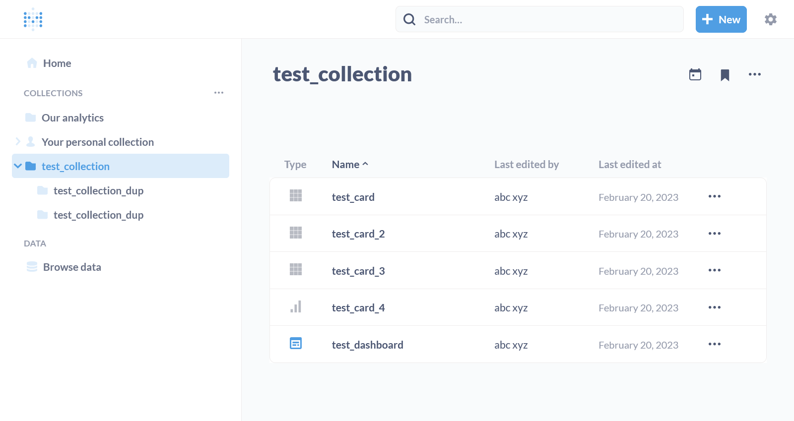

To run tests locally:
- Clone the repo: `git clone https://github.com/vvaezian/metabase_api_python.git`
- Go to the repo directory: `cd metabase_api_python`
- Run the initial setup for the desired Metabase version: `./tests/initial_setup.sh -v 0.45.2.1`  
This will download the Metabase jar file, runs it in the background, creates an admin user, creates some collections/cards/dashboards which will be used during unittest
- Run the unittests: `python3 -m unittest tests/test_metabase_api.py`

After `initial_setup.sh` is finished, you can login to the running local Metabase by browsing 'http://localhost:3000' and entering email: 'abc.xyz@gmail.com' and password 'xzy12345'

